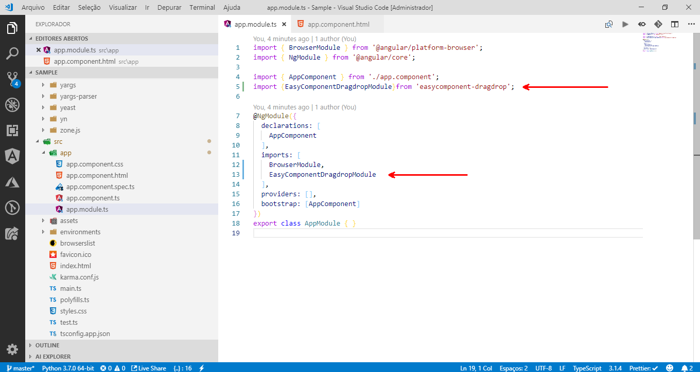

See the step by step to use the Drag 'n Drop

1- npm install easycomponent-dragdrop --save
 

2- In the angular module you have import EasyComponentDragdropModule

3- Now , in the html tag just add the directive easyMovable 

4- Voila !!
--------------------------------------

Do. Or do not. There is no try.
